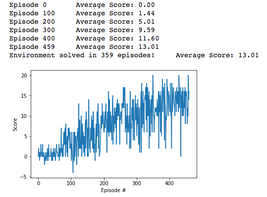

# Udacity Project 1 - Navigation

## Description

### Objective

To train a [Deep Q Learning](https://deepmind.com/research/dqn/) agent for the Banana collection game in UnityML agents

### Background

**Reward**: The agent geta a reward of +1 for collecting a yellow banana, and a reward of -1 for collecting a blue banana. Thus, the goal of the agent is to maximise the long term reward by collecting as many yellow bananas as possible while avoiding blue bananas.

**State**: Every state the agent is in can be represented by a vector that has 37 dimensions and contains the agent's velocity, along with ray-based perception of objects around agent's forward direction. Given this information, the agent has to learn how to best select actions.

**Actions**: The agent can take four different actions namely,:

0 - move forward.
1 - move backward.
2 - turn left.
3 - turn right.

**Termination**: The agent terminated after taking 300 time steps.

In order to consider the environment has been solved, the agent must get an average score of +13 over 100 consecutive episodes.

## Results

The average reward collection over 100 episodes plotted in a graph

